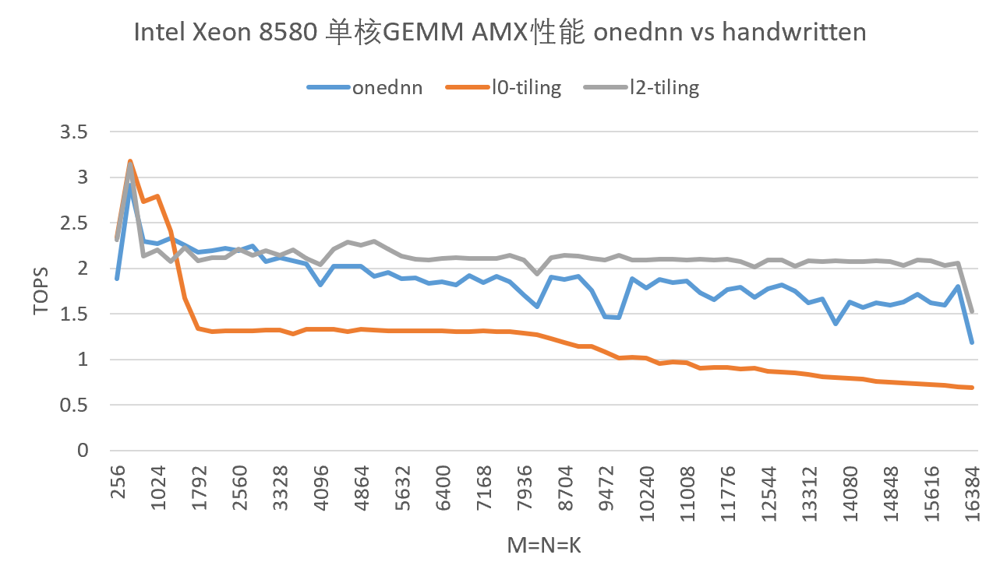
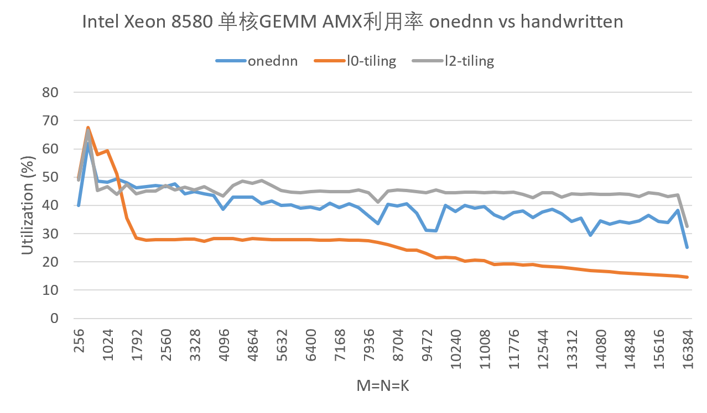
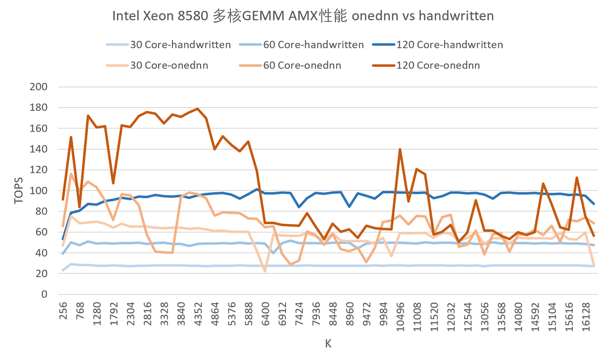
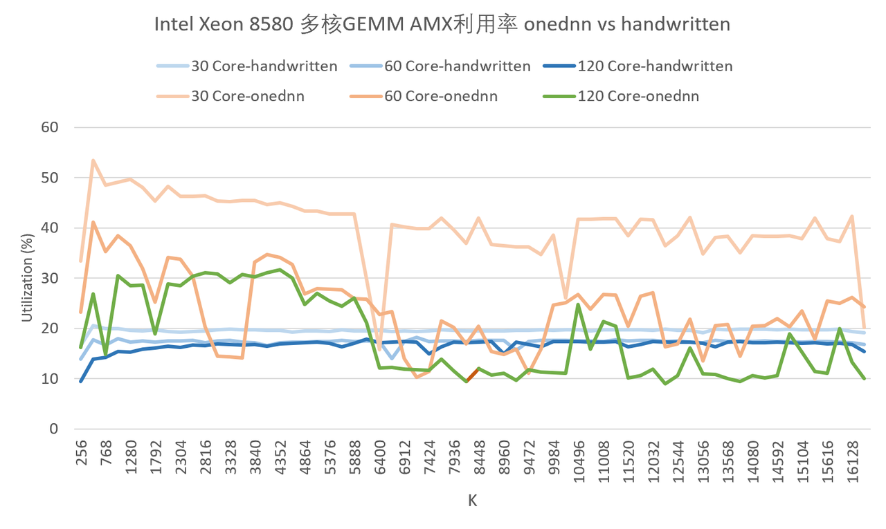

# amx-gemm-handwritten

手写Intel AMX矩阵乘法算子。

- 1-amx-gemm-l0-tiling：Tile Register级矩阵分块，TM = TN = 32
- 2-amx-gemm-l2-tiling：L2 Cache级矩阵分块，TM = TN = TK = 512
- todo：prefetch
- 4-amx-gemm-l2-tiling-multi-thread：多线程版本，TM = TN = TK = 512

## 性能测试结果

- 单核AMX性能/利用率，l0-tiling/l2-tiling与onednn的对比，onednn数据采用benchdnn matmul测试

- 多核AMX性能/利用率，l2-tiling-multi-thread与onednn的对比，包括30核、60核、120核三组数据，onednn数据采用benchdnn matmul测试

